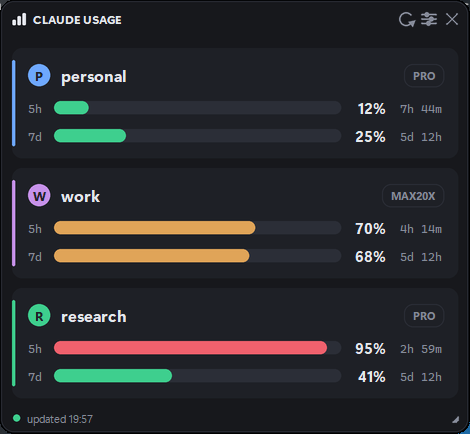

# Claude Usage Monitor

A floating, always-on-top panel showing the **5-hour session** and **7-day weekly** usage
of every Claude account you're signed into — all of them at once, not just the one you're
currently using.



The numbers come from the same endpoint Claude Code's own `/usage` command calls, so they
are the real limit percentages — not token counts estimated from local transcripts.

## Install

Needs Python 3.8+ (tkinter ships with it). Pillow is optional but recommended — without it
the panel still runs, just without antialiasing.

```bash
pip install pillow
python monitor.pyw --selftest     # verify before first run
pythonw monitor.pyw               # launch, no console window
```

Double-clicking `monitor.pyw` works too.

## Tracking several accounts

You don't configure accounts by hand. The monitor reads Claude Code's own credential files
and files each account under its email:

1. Start the monitor.
2. In Claude Code, `/login` to your other account.
3. Within one poll it appears as a new row — or hit **⚙ → + Add account** for it immediately.

Repeat once per account. From then on each is tracked independently and refreshes its own
token, so you don't have to stay logged into it.

If you run accounts in parallel via separate `CLAUDE_CONFIG_DIR` folders, point the monitor
at them with **⚙ → Watch folder…**, or set `CLAUDE_MONITOR_DIRS` (path-separated).

## Settings

Click **⚙** on the panel.

| Setting | Notes |
|---|---|
| Refresh every | Seconds or minutes. Floored at 30s — each account costs one request per poll. |
| Theme | dark / light / black (OLED) |
| Font | Display (Segoe UI Variable + Cascadia Mono), Segoe, or Bahnschrift |
| Font size | 7–16 |

Drag anywhere to move, grab the bottom-right corner to resize, `✕` or `Esc` to close.
Size, position and settings persist.

## Security

`store.json` sits next to the script and holds **live OAuth refresh and access tokens** for
every tracked account, plus their email addresses. It is gitignored. Never commit it, sync
it, or paste its contents anywhere — a refresh token is enough to use your account.

The app talks to exactly two hosts: `api.anthropic.com` to read usage and
`platform.claude.com` to refresh tokens. Nothing is sent anywhere else, and there is no
telemetry.

## Notes

- Row shows `re-login needed` when a refresh token has been revoked — `/login` to that
  account again and it recovers.
- A failed refresh backs off (1m → 2m → 4m, capped at 15m) rather than retrying every poll.
- On a Pro plan the API reports no separate Opus weekly bucket, so only the two bars appear.
- `--selftest` runs the logic checks plus 234 render passes across every theme, font size,
  window size and card state.

## Licence

MIT
